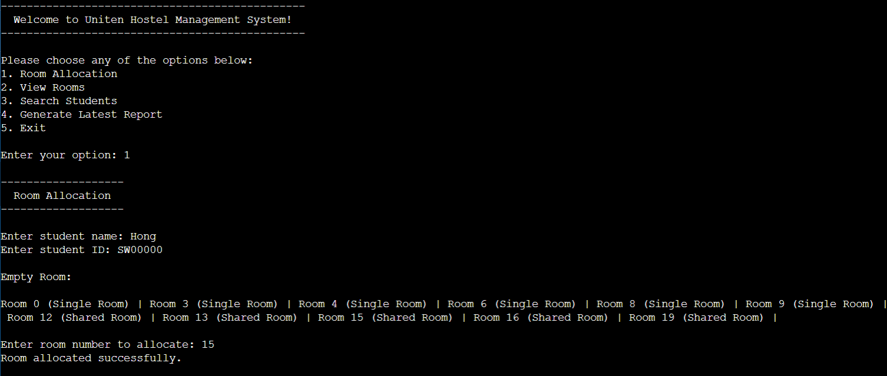

# Hostel-Management-System
The UNITEN Hostel Management System, developed in Java, streamlines the process of managing student accommodations by providing an efficient and organized solution. It enables administrators to handle room assignments, student records, fee tracking, and maintenance requests seamlessly. With an intuitive interface and automated functionalities, the system reduces manual errors, enhances administrative efficiency, and ensures a smoother experience for both students and management.

